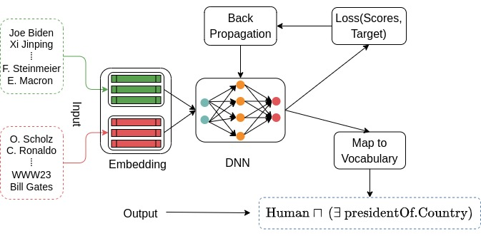
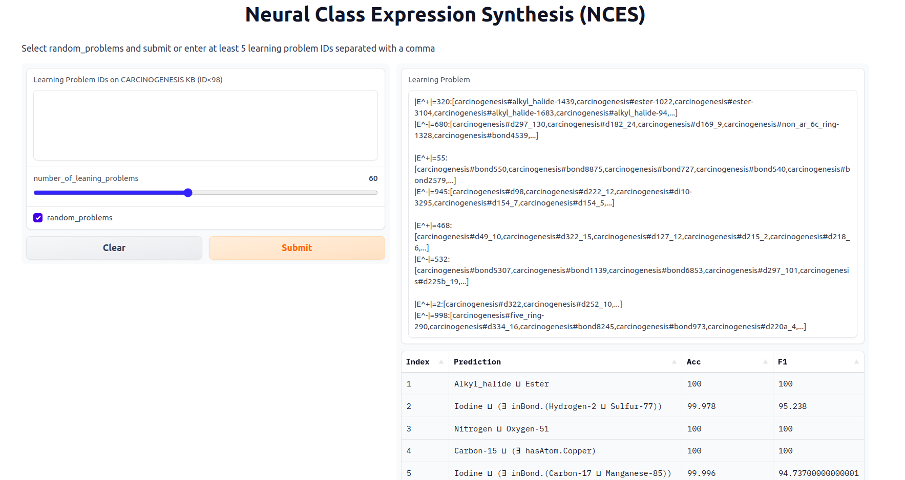

# NCES
Learning class expressions in expressive DLs using neural networks




## Installation

Clone this repository:
```
https://github.com/fosterreproducibleresearch/NCES2.git
``` 

Make sure Anaconda3 is installed in your working environment then run the following to install all required librairies for NCES2:
```
conda env create -f environment.yml
```
A conda environment (nces) will be created. Next activate the environment:
``` conda activate nces```

Download datasets from [drive](https://drive.google.com/file/d/1SJ2vuCjflJld8EEN4ay7Ock_W3F_zgCB/view?usp=sharing). Extract the zip file into NCES2/ and if necessary, rename the folder as datasets

To run search based algorithms CELOE, ELTL and ECII, install Java 8+ and Maven 3.6.3+

Dowload DL-Learner-1.4.0 from [github](https://github.com/SmartDataAnalytics/DL-Learner/releases) and extract it into the directory NCES2

Clone DL-Foil from [bitbucket](https://bitbucket.org/grizzo001/dl-foil.git) into NCES2. Make sure the script ` generate_dlfoil_config_all_kbs.py` is copied into dl-foil. This file can be found at [prepare_file](https://github.com/fosterreproducibleresearch/NCES2/blob/main/dl-foil/generate_dlfoil_config_all_kbs.py).

## Reproducing the reported results

### NCES2 (Ours)


*Open a terminal in NCES2/*
- Reproduce training NCES2: ``` python train.py ``` optionally with the following options:

``` 
  --kbs {carcinogenesis,mutagenesis,semantic_bible,vicodi} [{carcinogenesis,mutagenesis,semantic_bible,vicodi} ...]
                        Knowledge base name
  --models MODELS [MODELS ...]
                        Neural models
  --kb_emb_model KB_EMB_MODEL
                        Embedding model name
  --load_pretrained LOAD_PRETRAINED
                        Whether to load the pretrained model on carcinogenesis
  --learner_name {LSTM,GRU,SetTransformer}
                        Neural model
  --knowledge_base_path KNOWLEDGE_BASE_PATH
                        Path to KB owl file
  --path_to_csv_embeddings PATH_TO_CSV_EMBEDDINGS
                        KB embedding path
  --learning_rate LEARNING_RATE
                        Learning rate
  --embedding_dim EMBEDDING_DIM
                        Number of embedding dimensions
  --input_size INPUT_SIZE
                        Number of embedding dimensions in the input
  --num_workers NUM_WORKERS
                        Number of workers to use to load training data
  --proj_dim PROJ_DIM   The projection dimension for examples
  --num_inds NUM_INDS   Number of induced instances
  --num_heads NUM_HEADS
                        Number of attention heads
  --num_seeds NUM_SEEDS
                        Number of seed components in the output
  --num_examples NUM_EXAMPLES
                        Total number of examples for concept learning
  --ln LN               Whether to use layer normalization
  --decay_rate DECAY_RATE
                        Decay rate for the optimizer
  --grad_clip_value GRAD_CLIP_VALUE
                        Gradient clip value
  --opt OPT             Name of the optimizer to use
  --rnn_n_layers RNN_N_LAYERS
                        Number of recurrent network layers
  --max_length MAX_LENGTH
                        Maximum length of class expressions
  --drop_prob DROP_PROB
                        Dropout rate in neural networks
  --epochs EPOCHS       Number of training epochs
  --batch_size BATCH_SIZE
                        Training batch size
  --cross_validate CROSS_VALIDATE
                        Whether to use a 10-fold cross-validation setting
  --shuffle_examples SHUFFLE_EXAMPLES
                        Whether to shuffle positive and negative examples in the dataloader
  --test TEST           Whether to evaluate the concept synthesizer on the test data during training
  --final FINAL         Whether to train the concept synthesizer on test+train data
  --save_model SAVE_MODEL
                        Whether to save the model after training
  ```

- To reproduce evaluation results on concept learning: ``` python reproduce_nces ```. Use -h for more options.

*Remark: --kb is one of carcinogenesis, mutagenesis, semantic_bible, vicodi*

### DL-Learner (Lehmann et al.)

*Open a terminal and navigate into dllearner/* ``` cd NCES2/dllearner```
- Reproduce CELOE and ELTL concept learning results: ``` python reproduce_dllearner_experiment.py --algo --kb --max_runtime ```

### DL-Foil (Fanizzi et al.)

*Open a terminal and navigate into dl-foil/* ``` cd NCES2/dl-foil```

- Run mvn package

- Run ` python generate_dlfoil_config_all_kbs.py ` to prepare configuration files for all knowledge bases

- Reproduce concept learning results: ` mvn -e exec:java -Dexec.mainClass=it.uniba.di.lacam.ml.DLFoilTest -Dexec.args=DL-Foil2/kb_config.xml `

### ECII (Sarker et al.)

*Open a terminal and navigate into ecii/* ``` cd NCES2/ecii/```
- Download the jar file `ecii_v1.0.0.jar` into ecii/

- Run `python generate_config_ecii.py ` to prepare configuration files

- To start concept learning, run `java -Xms2g -Xmx8g -Xss1g -jar ecii_v1.0.0.jar -b kb/`

- Run `python parse_ecii_output.py ` to parse the output and save the results such as f_measure and runtime


### EvoLearner (Heindorf et al.)

*Open a terminal and navigate into evolearner/* ``` cd NCES2/evolearner/```

- Run `python run_evolearner.py `. Use options to select the knowledge base, save results, or enable logging. Example `python run_evolearner.py --kbs carcinogenesis --save_results True --verbose True` 


## How to predict with NCES2

To see example predictions using pretrained NCES2 instances, refer to [predict](https://github.com/fosterreproducibleresearch/NCES2/blob/main/model_prediction.ipynb)


## Bring your own data

To train NCES2 on a new knowledge base, create a new folder under datasets and add the OWL format of the knowledge base in the folder. Make sure the owl file has the same name as the folder you created. Follow the 3 steps below to train NCES2 on your knowledge base.

- (1) Generating training data for NCES2: `cd generators/` then ` python generate_data.py --kbs your_folder_name `. Use -h for more options. For example, use `--num_rand_samples 500` combined with `--refinement_expressivity 0.6` to increase the amount of training data.

- (2) Computing an embedding for your knowledge base: `cd embeddings/` then ` python compute_embeddings.py --kbs your_folder_name --model_name ConEx `

- (3) Training NCES2 on your data: `cd NCES2/ ` then ` python train.py --kbs your_folder_name `. Use -h to see more options for training, e.g., `--batch_size` or `--epochs`


## Start an interactive session with NCES2 (deployment)

Run ` python deploy_nces.py ` in a terminal. Use -h for more options. A public link will be created and valid for 72 hours. Open the link in a web browser. Start running NCES2 by entering learning problem ids or by selecting random learning problems, as in the screenshot below.


